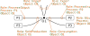

(sec:observations)=
# Observations

An *Observation* represents a single piece of information about the system.

## System roles

:::{figure-md} system-roles


How the {term}`Role`s of {term}`Observation`s relate to different parts of the MEFA system structure that can be measured. An observation with role {term}`ProcessInput` and {term}`ProcessOutput` refers to a specific single flow in the system, and must be linked to both a process and an object. In contrast, {term}`SoldProduction`, {term}`Consumption`, {term}`Import` and {term}`Export` refer to the sum over all processes and must be linked only to an object.
:::

## Missing data

Since data is sometimes redacted, it's important to distinguish "missing data" from "no data"

## Concept reference

```{glossary}
Observation
  One piece of observed data.

TimePeriod
  Describes the temporal period over which an Observation is measured. Often it is a year period, but it could be financial years, calendar years, months, days, hours, minutes, seconds, or arbitrary spans.

Region
  Describes the spatial area over which an Observation is measured.

Role
  The type of data represented by the Observation.
```

Specific roles:

```{glossary}
Flow
  Subclass of {term}`Role` for Observations which measure flows, that is, movement of {term}`Object`s between {term}`Process`es.

Import
  Subclass of {term}`Flow` which describes an {term}`Object` entering the {term}`Region` of interest.

Export
  Subclass of {term}`Flow` which describes an {term}`Object` leaving the {term}`Region` of interest.
  
ProcessInput
  Subclass of {term}`Flow` which describes an {term}`Object` entering a specific {term}`Process`.
   
ProcessOutput
  Subclass of {term}`Flow` which describes an {term}`Object` leaving a specific {term}`Process`.

SoldProduction
  Subclass of {term}`Flow` which describes the total output of an {term}`Object` from all {term}`Process`es that produce it. The term "sold production" is defined by PRODCOM, as opposed to the goods that may have been produced within the factory boundary, but haven't yet left the factory gate.
  
Stock
  Subclass of {term}`Role` for Observations which measure stocks, that is, the accumulation of {term}`Object`s within {term}`Process`es.

```

Object properties:

```{glossary}
objectDefinedBy
  Links an Observation to the Object it describes

processDefinedBy
  Links an Observation to the Process it describes, where applicable (some, such as SoldProduction, relate to only an Object independent of Processes).

hasTimePeriod
  Links an Observation to the TimePeriod in which it was measured.

hasRegion
  Links an Observation to the Region in which it was measured.

hasRole
  Links an Observation to the Role representing the type of data which it measures.

metric
  Describes the way in which a measurement is quantified, e.g. by mass or volume (linked to QUDT `QuantityKind`)
```

Data properties:

```{glossary}
measurement
  The numeric value of the Observation.
```
